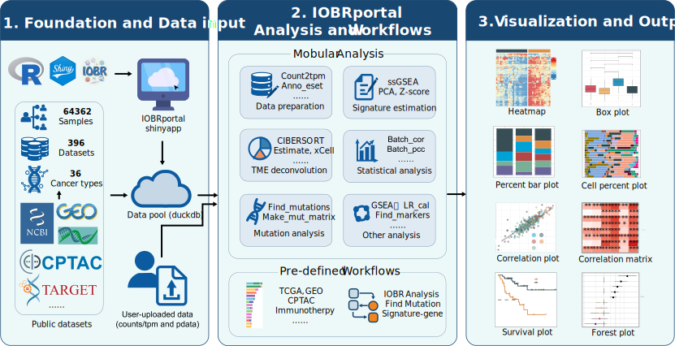

# Framework

## 📚 Introduction

IOBRportal is a Shiny-based, cloud-deployable web platform built on the IOBR ecosystem to deliver an end-to-end, user-friendly environment for immuno-oncology and bulk transcriptome analyses. It unifies **database-backed curated cohorts** with **user-uploaded datasets**, and provides two complementary entry modes—**Functions** (stepwise, modular analysis) and **Workflows** (pre-defined, guided pipelines)—to support efficient and reproducible TME-centric investigations.

Within a single interface, IOBRportal integrates core TME decoding and downstream analyses (including interaction-oriented exploration), and generates **publication-ready visualizations** with **standardized export** of results. By engineering integrated analysis workflows into an accessible web application, IOBRportal lowers technical barriers while improving practical efficiency and reproducibility for biomarker discovery and translational immuno-oncology research.

This book documents the IOBRportal workflow, modules, and usage.

## 💿 License

IOBRportal was released under the GPL v3.0 license. See **LICENSE** for details. The code contained in this book is simultaneously available under the GPL license; this means that you are free to use it in your own packages, as long as you cite the source. The online version of this book is licensed under the Creative Commons Attribution-NonCommercial-ShareAlike 4.0 International License.

## 🏆 Citations

If you use IOBRportal in your research, please cite the IOBR package and relevant method papers as appropriate.

## ✉️ Reporting bugs

E-mail questions or bug reports to **Qingcong Luo** (qingcongl@163.com) or **Dr. Dongqiang Zeng** (interlaken@smu.edu.cn).
